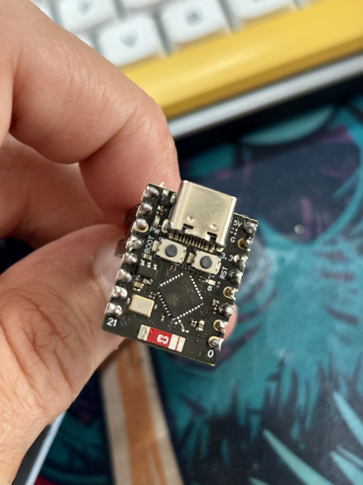
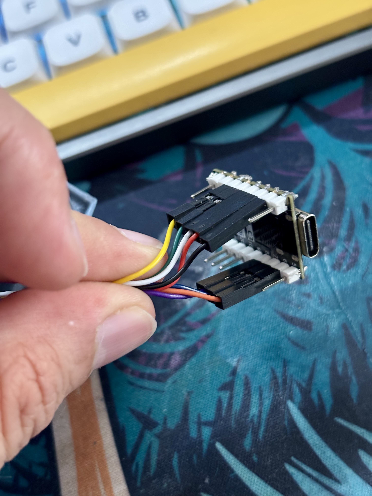

# WeAct Studio 2.13" ESP32 ePaper board

This directory contains the port to the
[WeAct Studio ePaper Module 2.13 inches](https://s.click.aliexpress.com/e/_ooJQs3J) 
board. #affiliate

And as controller I'm using a DOIT ESP32 EVKIT V1:
[DOIT ESP32 EVKIT V1](https://s.click.aliexpress.com/e/_DeEFuSB)  #affiliate

Recently updated to ESP32 C3 Super Mini:
[DOIT ESP32 EVKIT V1](https://s.click.aliexpress.com/e/_oDH5k5b) #affiliate

Wiring:
  BUSY = 8  
  CS   = 7
  RST  = 6
  DC   = 4
  SCK  = 3 
  MISO = -1
  MOSI = 2

This port was built using the Arduino IDE, with the following settings for the board:
  - Board: DOIT ESP32 EVKIT V1
    - Upload speed: 921600
    - CPU Frequency: 240MHz
    - Flash frequency: 40MHz
    - Flash mode: DIO
    - Flash size: 4MB
 - Board: Nologo ESP32C3
    - Upload speed: 921600
    - CPU Frequency: 160MHz
    - Flash frequency: 80MHz
    - Flash mode: QIO
    - Flash size (Partition Scheme): 4MB